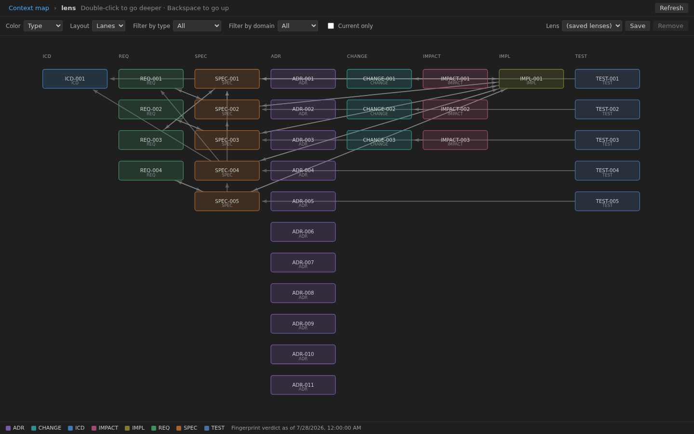
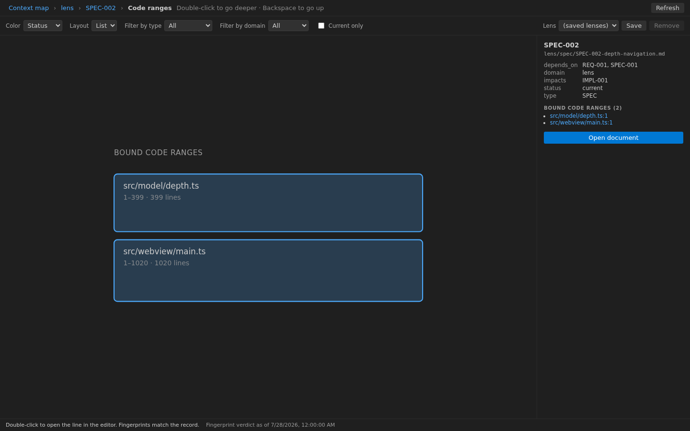
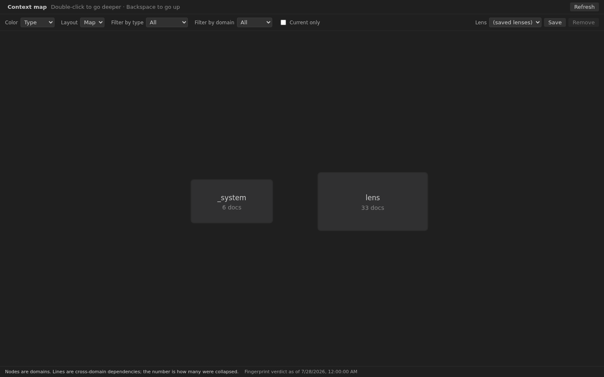

<!-- doctrine:view src=doctrine_docs as-of=2026-07-28 date=2026-07-28 refs=ICD-001,REQ-001,REQ-002,REQ-003,REQ-004,SPEC-001,SPEC-002,SPEC-003,SPEC-004,SPEC-005,ADR-001,ADR-002,ADR-005,ADR-006,ADR-007,ADR-008,ADR-009,ADR-010,ADR-011 -->

# Doctrine Lens

See a [doctrine](https://github.com/Forest-Project-Lab/doctrine)-governed document tree as **one map** — from the whole system down to the exact lines of code a spec governs.

**A context map is not drawn. It is derived.** doctrine already forces `domain`,
`depends_on`, and "cross-domain dependencies may only target an ICD" into every
document's frontmatter. The information needed to draw the map is already there,
in machine-readable form, the moment you lay down a governance tree. This
extension adds no rules of its own — it just draws what is already there.

*日本語の説明は下の [日本語](#日本語) にあります。*



---

## What it does

### Depth — the same gesture at every level

| Depth | What you see | Nodes | Edges |
|---|---|---|---|
| **L0** Context map | The whole system | Domains | Cross-domain dependencies (same pair collapsed, count shown) |
| **L1** Domain interior | One domain | Its documents | Dependencies inside the domain |
| **L2** Document | One document | The focus and what touches it | Edges touching the focus |
| **L3** Code | One document's implementation | Ranges enclosed by `doctrine:begin/end` | None |

Double-click to go deeper, `Backspace` to come back up — the same at every level.
Pick a range at L3 and the editor opens that line.

### Lens — turn the view, don't add screens

A lens is four independent dials. Changing one leaves the other three alone.

| Dial | Choices |
|---|---|
| **Color** | type / status / domain / owner |
| **Filter** | current only / domain / type (all applied together) |
| **Layout** | map / lanes / detail / list |
| **Depth** | L0 – L3 |

Name a lens and it is saved per workspace folder.

### Document ↔ code, both ways



**Code → document.** A headline appears at the start of every marked range.
Click it and the governing document opens. If the recorded fingerprint and the
current code disagree, that shows in the headline and the gutter changes color.
This works whether or not the map is open.

**Document → code.** At L2, select the focus again to descend to L3 and see the
bound ranges. Pick one and the editor opens that line. A command does the same,
and offers a choice when a document has several ranges.

---

## Getting started

### Two prerequisites

| Prerequisite | Why |
|---|---|
| **Python 3** | The doctrine CLI is written in Python (zero pip dependencies) |
| **The doctrine plugin** | The source of truth for the rules. This extension holds none — it reads verdicts |

Node is **not** required at runtime; the extension ships bundled.

### Install the doctrine plugin

With [Claude Code](https://claude.com/claude-code), two lines:

```bash
claude plugin marketplace add https://github.com/Forest-Project-Lab/doctrine.git
claude plugin install doctrine@forest-project-lab --scope project
```

Without Claude Code, clone it anywhere and point `doctrineLens.pluginPath` at it:

```bash
git clone https://github.com/Forest-Project-Lab/doctrine.git ~/doctrine
```

### Lay down a governance tree

If you don't have one yet, call `/doctrine:docs-system-init` in a Claude Code
session, or run the plugin's `scaffold.py` directly:

```bash
python3 <plugin path>/scripts/scaffold.py --root . --level 3
```

Keep the tree directly under your workspace folder (`<workspace>/doctrine_docs/`).

### Open it

Command palette → **`Doctrine Lens: Open the map`**.

If nothing appears, look at the status bar (bottom right). It tells you which of
the three it is: no governance tree, python won't start, or the plugin isn't found.



### Commands

| Command | What it does |
|---|---|
| `Doctrine Lens: Open the map` | Open the map |
| `Doctrine Lens: Refresh the map` | Re-run the upstream CLI |
| `Doctrine Lens: Show the open document on the map` | Jump to the open document's L2 |
| `Doctrine Lens: Open the document for this range` | Open the document governing the range at the cursor |
| `Doctrine Lens: Jump to this document's implementation` | Jump to the code bound to the open document |
| `Doctrine Lens: Choose which doctrine tree to show` | Switch trees when several workspace folders have one |

**There are no default keybindings** (ADR-009) — installing this extension must
not take a chord away from you. Add your own in `keybindings.json`:

```json
[
  { "key": "ctrl+k ctrl+g", "command": "doctrineLens.openDocumentForRange",
    "when": "editorTextFocus" },
  { "key": "ctrl+k ctrl+v", "command": "doctrineLens.jumpToImplementation",
    "when": "editorTextFocus && editorLangId == markdown" }
]
```

### Settings

| Key | Default | Scope | Meaning |
|---|---|---|---|
| `doctrineLens.pythonPath` | `python3` | machine | The python that runs the doctrine CLI |
| `doctrineLens.pluginPath` | (empty) | machine | The doctrine plugin. Empty resolves from the install ledger |
| `doctrineLens.docsRoot` | (empty) | window | Path to the tree, relative to the workspace folder |
| `doctrineLens.timeoutMs` | `20000` | window | Upper bound on one CLI call |
| `doctrineLens.autoRefresh` | `true` | window | Refresh when a governed `.md` or marked source is saved |
| `doctrineLens.auditDebounceMs` | `2500` | window | Wait before the full audit that decides fingerprint mismatches. `0` = only on explicit refresh |

`pythonPath` and `pluginPath` are **machine-scoped on purpose** (ADR-010): they
choose what gets executed, so a repository you open must not be able to change
them. Set them in your user or remote settings, not in `.vscode/settings.json`.
The extension also declares that it does **not** run in untrusted workspaces.

---

## Design

### It holds no governance rules (REQ-003)

No type list, no status vocabulary, no location table, no fingerprint comparison.
It runs the upstream CLI and draws the JSON (ADR-001).

```
dep-graph.py --classify-edges --json  → all nodes and edges
read _registry in place               → type order, which statuses mean "current"
trace-index.py --format json          → document ↔ code ranges
docs-audit.py --json                  → verdicts (fingerprint mismatches)
```

Even the vocabulary is read from upstream at runtime, so a new document type
appears on the map without changing this extension. `npm test` enforces this
literally: if an upstream vocabulary word turns up in the implementation, the
test fails.

### Facts and verdicts are separate (ADR-005)

Where a range *is* comes from `trace-index`. Whether a fingerprint *disagrees*
comes from `docs-audit`. This extension never compares fingerprints itself — a
second judge would drift from the gate, which is exactly the failure doctrine
exists to catch.

### Two fetch cadences (ADR-008)

| Cadence | What runs | When |
|---|---|---|
| Fast | registry, `dep-graph`, `trace-index` | on save (coalesced, 400 ms) |
| Slow | the above plus `docs-audit` | on startup, on explicit refresh, after quiet (2500 ms) |

Measured on this repository (39 documents, 197 files reached): `dep-graph` 127 ms,
`trace-index` 645 ms, `docs-audit` 543 ms, registry probe 21 ms. `dep-graph` runs
first on its own — everything else needs its result to be worth fetching — and the
remaining three then run in parallel. So the fast cadence costs about
`127 + max(21, 645)` ≈ 770 ms and the slow one about `127 + max(21, 645, 543)`
≈ 770 ms; on this tree the audit hides entirely behind `trace-index`. On a large
repository, where the audit dominates, set `auditDebounceMs: 0` and run it only on
demand. The screen always shows *when* the fingerprint verdict was taken, so a
stale verdict never reads as a fresh fact.

### Deterministic drawing (ADR-002)

No charting library — the SVG is assembled by hand, and layout uses neither
randomness nor the clock. The same tree always produces the same coordinates.
Force-directed layout would jitter, and the map would stop being readable as a
version-control diff.

### It governs itself

`doctrine_docs/` holds this product's own ICD, REQ, SPEC, ADR, IMPL and TEST.
The code carries `doctrine:begin SPEC-00N` markers, and each spec records the
sha256 of the range it governs. Change what a marker encloses without
re-recording, and the audit raises `trace_stale`.

---

## What it does not do

See `doctrine_docs/_system/non-goals.md` for the full list with reasons. In short:
no governance rules of its own, no charting library, no complaint about unmarked
code, no writes to the governance tree, no default keybindings, and no mixing of
several trees at once.

---

## Building from source

For contributors. **Node 22 or newer** is required here (not at runtime).

```bash
npm install
npm run compile          # produces dist/extension.js and dist/webview.js
```

Press `F5` in VS Code to launch an extension host (`.vscode/launch.json` is in
the repository; it builds first via the default build task).

```bash
npm run check            # typecheck → tests → bundle → full governance audit
xvfb-run npm run test:integration  # drives a real VS Code: headlines, commands, loading
npm run package          # builds the .vsix
npm run docs:trace       # lists marked ranges and their fingerprints
npm run docs:render      # redraws the projections
```

`test:integration` needs GTK3 and an X server (the devcontainer's Dockerfile
installs both, including `xvfb`). Without a display it fails, so run it under
`xvfb-run` as shown. It is deliberately **not** part of `npm run check`, so an
environment that cannot run it never reports "not run" as "passed".

When running it from inside VS Code, the parent's `ELECTRON_RUN_AS_NODE` must be
dropped first — `tools/run-vscode-test.mjs` does that. Without it the new
Electron starts as plain Node and fails with a misleading
`Cannot find module 'vscode'`.

The `.vsix` includes everything by default, so adding a working directory means
adding a line to `.vscodeignore`.

### Checking the webview outside the editor

The webview is plain DOM and SVG, so it can be opened in an ordinary browser.

```bash
npm run preview   # rebuilds .preview/ from src, then drives it and captures shots
```

`shoot-preview.mjs` refuses to run against a `.preview/` older than `src/`, so a
failed rebuild can never be mistaken for a passing visual check — that mistake
was made here once, and the screenshots in this README were stale because of it.

It uses the real shell (`src/panel/html.ts`) and the real strings
(`src/l10n.ts`) rather than copies, so what you check matches what ships. Note
that a browser is *not* a VS Code webview sandbox — modal dialogs behave
differently there, so anything involving them must be checked in the extension
host instead.

---

## Development environment

This repository sits on the claude-harness kit: the
[doctrine plugin](https://github.com/Forest-Project-Lab/doctrine) (typed document
governance, installed from its marketplace), `tools/doc-manager/` (fetches
primary sources and pins them by sha256), and `.devcontainer/` (Node 22, Python 3,
Playwright, Claude Code).

---

## 日本語

統治木を、俯瞰から実装のコード範囲まで**一枚の地図**として見る VS Code 拡張機能です。

**文脈の地図は描くものではなく、導出されるもの**です。
[doctrine](https://github.com/Forest-Project-Lab/doctrine) は `domain`・`depends_on`・
「ドメイン越えの依存は相手の ICD 宛だけ」という規則を全文書の frontmatter に強制しています。
地図を描くための情報は、統治木を敷いた時点ですでに機械可読な形で揃っています。
この拡張機能は新しい規則を持たず、その揃っている情報を描くだけです。

### 前提は二つ

**Python 3** と **doctrine プラグイン**だけです。実行時に Node は要りません。
統治木は作業フォルダの直下（`<作業フォルダ>/doctrine_docs/`）に置いてください。

導入したら、コマンドパレットで **`Doctrine Lens: Open the map`**。
何も出ないときは右下の状態の帯を見てください。統治木が無い・python が起動しない・
プラグインが見つからない、のどれかが理由と一緒に出ます。

### 深度とレンズ

降りるのはダブルクリック、上がるのは `Backspace`。段ごとに操作は変わりません。
L0 文脈の地図 → L1 ドメイン内部 → L2 文書 → L3 コード範囲。

レンズは色・絞り・配置・深度の四つのダイヤルで、互いに独立です。
名前を付けて保存でき、作業フォルダごとに保ちます。

### 設計の要点

- **統治の規則を持ちません**（REQ-003）。型・status・置き場所・指紋の突き合わせのいずれも、
  上流の判定の結果を読むだけです
- **事実と判定を分けます**（ADR-005）。範囲の在処は `trace-index`、
  指紋の食い違いの判定は `docs-audit` から取ります
- **既定のキー割り当てを持ちません**（ADR-009）。導入しただけで編集器の既定を奪わないためです
- **実行体を選ぶ設定は machine scope です**（ADR-010）。開いたリポジトリが
  python を差し替えられないようにするためです

やらないことの一覧は `doctrine_docs/_system/non-goals.md` に理由つきで書いてあります。

---

## License

MIT
