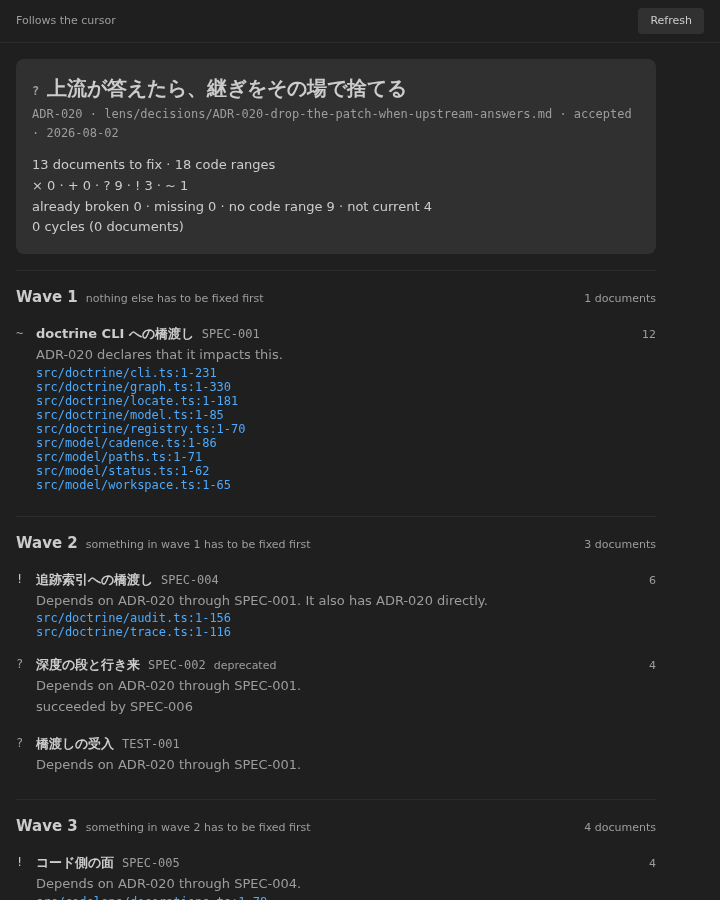
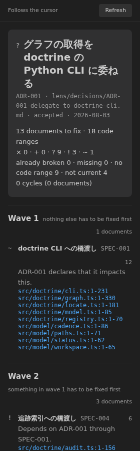

<!-- doctrine:view src=doctrine_docs as-of=2026-08-02 date=2026-08-02 refs=ICD-001,REQ-001,REQ-002,REQ-003,REQ-004,SPEC-001,SPEC-004,SPEC-005,SPEC-006,ADR-001,ADR-006,ADR-007,ADR-008,ADR-009,ADR-010,ADR-011,ADR-012,ADR-013,ADR-014,ADR-015 -->

# Doctrine Lens

One question, answered from where your cursor already is:

> **If I change this, what will I have to fix, and in what order?**

Not a map. A list — ordered, with a reason on every line.

**The canonical statement of what this product solves lives in the tree, not here** —
`doctrine_docs/_system/REQ-000-what-this-product-solves.md`. This README is a *view*:
maintained by hand, stamped with the version it was written against. When the two
disagree, the tree is right.

*日本語の説明は下の [日本語](#日本語) にあります。*



---

## What it does

Put your cursor inside a `doctrine:begin` range, or open a governed `.md`.
That is the **origin**. You select nothing; the screen follows the cursor.

```
Follows the cursor                                                   [Refresh]

  ? いま触れているものから、直すことになるものを順に辿る
    REQ-001 · lens/REQ-001-zoom-navigation.md · current · 2026-07-29

    11 documents to fix · 9 code ranges
    × 0 · + 0 · ? 8 · ! 3 · ~ 0
    already broken 0 · missing 0 · no code range 8 · not current 4
    0 cycles (0 documents)

  Wave 1   nothing else has to be fixed first                    2 documents
  !  追跡索引への橋渡し               SPEC-004                              6
     Has REQ-001 in depends_on. Its premise changes.
     src/doctrine/audit.ts:1-156
     src/doctrine/trace.ts:1-116
  ?  深度の段と行き来                 SPEC-002  deprecated                  4
     Has REQ-001 in depends_on. Its premise changes.
     succeeded by SPEC-006

  Wave 2   something in wave 1 has to be fixed first             4 documents
  !  コード側の面                     SPEC-005                              4
     Depends on REQ-001 through SPEC-004.
     src/codelens/decorations.ts:1-78
     …
  ?  レンズ文法                       SPEC-003  deprecated                  2
     Depends on REQ-001 through SPEC-002.
     succeeded by SPEC-006
  …

  Wave 3   something in wave 2 has to be fixed first             3 documents
  !  帰結の明細                       SPEC-006                              2
     Depends on REQ-001 through SPEC-005. It also has REQ-001 directly.
     src/model/consequence.ts:1-746
     …

  57 documents reach the origin in neither direction and are not listed
  1 finding is outside this screen's question (it belongs to no document)
  The number on the right of a row is how many others it settles once fixed
  Upstream docs-audit ran 36 checks at 2026-08-02 00:00
  × broken   + missing   ? nowhere to fix   ! fix   ~ review
```

That is this repository's own tree. `SPEC-004` sorts first in wave 1 because the
`6` on its right says six more documents settle once it is fixed. `SPEC-002` is
`?`: it depends on the origin, but has no code bound to it, so there is nowhere
to make the change. Rows with nothing behind them show no number at all, because
a number that is always zero is noise.

Four rows say `deprecated`; the other seven say nothing about status, because
they are current and **the default is not narrated**. The summary's `not
current 4` is what keeps that silence honest — count the words on screen and you
get 4. Each of those four also names its successor, so a row you should not be
editing tells you where to go instead.

### Five symbols, strictly exclusive

Each comes from **exactly one** upstream fact. Heaviest wins.

| Symbol | Means | Comes from |
|---|---|---|
| `×` | already broken | a `docs-audit` finding with severity error or warn |
| `+` | missing | `dep-graph --reverse-orphans` |
| `?` | nowhere to fix | reached, but zero code ranges bound to it |
| `!` | fix | it has the origin in `depends_on` — its premise changes |
| `~` | review | something declared that it *impacts* this |

`!` and `~` stay separate symbols with separate sentences. Upstream keeps
`depends_on` and `impacts` as different ends of a relation and says not to mix
them. Direction is carried by the symbol and the sentence — never by a 6px
arrowhead you have to squint at.

### The order is the point

Waves come from the **longest** distance to the origin, not the shortest. If
`origin → C → B` and `origin → B` both exist, `B` is in wave 2, because fixing
`B` before `C` means its premise changes twice. A screen that answers "in what
order" must not answer it wrongly.

Cycles have no order, so they are not given one. They drop out of the waves and
are written down as a line of text — `A → B → A` — with upstream's `dep_cycle`
message attached.

### It does not narrate the default

Rows used to print `current` next to every id. Measured on this repository's own
tree at `497e13b` — 70 documents, each used as an origin in turn, 273 rows in
total — **225 of them (82.4%) said `current`.** Four rows on screen, four
identical words, nothing distinguished.

The count carries the commit it was taken at, because the tree grows: writing
this one change added four governance documents and moved the number 67 → 70.
**A measurement without its basis goes stale in silence.**

Now only the 17.6% that are *not* current say so, and they are the only rows on
the screen carrying a status word at all. Two rows that used to wrap to a second
line at 280px now fit on one.

Removing a word cannot silently mean "everything is fine", so the summary
carries the count: `already broken 0 · missing 0 · no code range 2 · not
current 4`. **The number says how many; the rows say which.** You can check one
against the other, and a build gate does exactly that on the real screen.

Which statuses count as "current" is not written down here. Upstream's registry
says `CURRENT_STATUSES = {"current", "accepted"}` and adds *"other slices MUST
use this, never a bare `== "current"`"* — so this extension asks, and compares
against the answer. If upstream cannot be read, nothing is hidden: every row
shows its status and the count is omitted. **Not knowing is never rendered as
good news.**

### It is designed for 280px



VS Code's minimum sidebar width is the baseline, not an afterthought. One column,
no second column at any width, and the line length stops at 640px. Nothing scrolls
sideways at any size — checked automatically at 720, 480 and 280px on every build.

### Document ↔ code, both ways

**Code → document.** A headline appears at the start of every marked range.
Click it and the governing document opens. If the recorded fingerprint and the
current code disagree, that shows in the headline and the gutter changes color.
This works whether or not the list is open.

**Document → code.** Every row ends in `file:line`. Click it and the editor
opens there. A command does the same, and offers a choice when a document has
several ranges.

---

## Getting started

### Two prerequisites

| Prerequisite | Why |
|---|---|
| **Python 3** | The doctrine CLI is written in Python (zero pip dependencies) |
| **The doctrine plugin** | The source of truth for the rules. This extension holds none — it reads verdicts |

Node is **not** required at runtime; the extension ships bundled.

### Install the doctrine plugin

With [Claude Code](https://claude.com/claude-code), two lines:

```bash
claude plugin marketplace add https://github.com/Forest-Project-Lab/doctrine.git
claude plugin install doctrine@forest-project-lab --scope project
```

Without Claude Code, clone it anywhere and point `doctrineLens.pluginPath` at
the **`plugin/` directory inside the clone** — not at the clone itself. The
repository root has its own `scripts/`, which is not the plugin.

```bash
git clone https://github.com/Forest-Project-Lab/doctrine.git ~/doctrine
# then set, in Settings:
#   doctrineLens.pluginPath = ~/doctrine/plugin
```

### Lay down a governance tree

If you don't have one yet, call `/doctrine:docs-system-init` in a Claude Code
session, or run the plugin's `scaffold.py` directly:

```bash
python3 ~/doctrine/plugin/scripts/scaffold.py --root . --level 3
```

Keep the tree directly under your workspace folder (`<workspace>/doctrine_docs/`).

### Open it

Put the cursor somewhere governed, then command palette →
**`Doctrine Lens: Show what this changes`**.

If nothing appears, look at the status bar (bottom right). It tells you which of
the three it is: no governance tree, python won't start, or the plugin isn't found.

If the screen says it has no origin, that is not an error — it names the file you
have open and says why it isn't one.

### Commands

| Command | What it does |
|---|---|
| `Doctrine Lens: Show what this changes` | Open the consequence list |
| `Doctrine Lens: Refresh` | Re-run the upstream CLI |
| `Doctrine Lens: Show what the open document changes` | Same, from the open document |
| `Doctrine Lens: Open the document for this range` | Open the document governing the range at the cursor |
| `Doctrine Lens: Jump to this document's implementation` | Jump to the code bound to the open document |
| `Doctrine Lens: Choose which doctrine tree to read` | Switch trees when several workspace folders have one |

**There are no default keybindings** (ADR-009) — installing this extension must
not take a chord away from you. Add your own in `keybindings.json`:

```json
[
  { "key": "ctrl+k ctrl+g", "command": "doctrineLens.openDocumentForRange",
    "when": "editorTextFocus" },
  { "key": "ctrl+k ctrl+v", "command": "doctrineLens.jumpToImplementation",
    "when": "editorTextFocus && editorLangId == markdown" }
]
```

### Settings

| Key | Default | Scope | Meaning |
|---|---|---|---|
| `doctrineLens.pythonPath` | `python3` | machine | The python that runs the doctrine CLI |
| `doctrineLens.pluginPath` | (empty) | machine | The doctrine plugin. Empty resolves from the install ledger |
| `doctrineLens.docsRoot` | (empty) | window | Path to the tree, relative to the workspace folder |
| `doctrineLens.timeoutMs` | `20000` | window | Upper bound on one CLI call |
| `doctrineLens.autoRefresh` | `true` | window | Refresh when a governed `.md` or marked source is saved |
| `doctrineLens.auditDebounceMs` | `2500` | window | Wait before the full audit that decides fingerprint mismatches. `0` = only on explicit refresh |

`pythonPath` and `pluginPath` are **machine-scoped on purpose** (ADR-010): they
choose what gets executed, so a repository you open must not be able to change
them. Set them in your user or remote settings, not in `.vscode/settings.json`.
The extension also declares that it does **not** run in untrusted workspaces.

---

## Design

### Why this isn't a map anymore (ADR-012)

It was. The map was measurably unreadable, and the measurements said something
more uncomfortable than "the layout needs work":

- The tree is 45 nodes, 45 edges, density 0.02. Research on node-link diagrams
  says a graph *that* small should win. It didn't.
- **Both axes were meaningless.** Columns were registry order, rows were id
  alphabetical. 52% of edges spanned two or more columns. Optimizing row order
  6000 times only took crossings from 31 to 24.
- **16 of 45 edges were the same fact written twice** — `A impacts B` and
  `B depends_on A`. The screen drew them as two opposed arrows, which reads as a
  cycle. The real cycle count was **zero**. A user asking "are mutually dependent
  things abnormal?" was reading a lie the screen had manufactured.
- **34 upstream checks existed. 11 were used.** The judgement layer was thrown
  away at the bridge, so the screen could only state facts, and every judgement
  was pushed onto the reader.

So the fix was not a better layout. A map answers "how is it all arranged",
which nobody was asking. This answers the question people actually have.

### One screen, one question (REQ-002)

There are no dials. No depth, no layout picker, no color-by, no saved views.
The previous version had "four independent dials" — and one of them existed
*only so the count would be four*. That is design as decoration.

Origin comes from the cursor. Everything else is derived. Nothing to configure
means nothing to configure wrongly.

### It holds no governance rules (REQ-003)

No type list, no status vocabulary, no location table, no fingerprint comparison.
It runs the upstream CLI and renders the JSON (ADR-001).

```
dep-graph.py --classify-edges --json  → nodes (with titles), edges, mirrored pairs
dep-graph.py --reverse-orphans        → what is missing
read _registry in place               → type order, which statuses mean "current"
read _termcheck in place              → which glossary words are approved
trace-index.py --format json          → document ↔ code ranges
docs-audit.py --json                  → every check upstream ran, unfiltered
```

Three findings from this rewrite were filed upstream and answered in 0.8.0:
[#149](https://github.com/Forest-Project-Lab/doctrine/issues/149) (nodes withheld
`title` — upstream dropped the whitelist entirely),
[#150](https://github.com/Forest-Project-Lab/doctrine/issues/150) (trace-index
ignored `.gitignore`) and
[#151](https://github.com/Forest-Project-Lab/doctrine/issues/151) (one relation
returned as two edges). **The local stopgaps were deleted the same day**
(`CHANGE-009`, `ADR-020`) — 137 lines gone, one fewer walk of the tree.

The number of checks is never written down here either: the footer says
"N checks" using the length of `checks_run` that upstream returned.

Even the vocabulary is read from upstream at runtime, so a new document type
appears without changing this extension. `npm test` enforces this literally: if
an upstream vocabulary word turns up in the implementation, the test fails.

### Facts and verdicts are separate (ADR-005)

Where a range *is* comes from `trace-index`. Whether a fingerprint *disagrees*
comes from `docs-audit`. This extension never compares fingerprints itself — a
second judge would drift from the gate, which is exactly the failure doctrine
exists to catch.

### Design values live in DESIGN.md (ADR-013)

Spacing, radii, type scale, weights and colors have exactly one source, and it
is not the CSS. `src/test/design.test.ts` **parses `DESIGN.md` itself** and
fails the build if the stylesheet uses a value the document doesn't list. Adding
a seventh spacing value means editing the design document, on purpose, in a diff
someone reviews.

That gate was built after measuring the old stylesheet: six spacing values (four
off the 4px grid), three radii, eight type steps whose adjacent ratios had a
median of 1.02, and two text colors 2.23 ΔE apart — below the threshold at which
a human eye can tell two grays apart at all.

The gate also catches itself: an early version read the allowed font weights out
of DESIGN.md's prose and picked up `500` from the sentence *"do not use 500"*.
Allowed values now live only in tables.

### Two fetch cadences (ADR-008)

| Cadence | What runs | When |
|---|---|---|
| Fast | registry, `dep-graph`, `trace-index`, titles | on save (coalesced, 400 ms) |
| Slow | the above plus `docs-audit` | on startup, on explicit refresh, after quiet (2500 ms) |

Measured on this repository (45 documents): `dep-graph` 127 ms, `trace-index`
645 ms, `docs-audit` 543 ms, titles 324 ms, registry probe 21 ms. `dep-graph`
runs first on its own — everything else needs its result to be worth fetching —
and the rest then run in parallel, so a full round is about 1.9 s. On a large
repository, where the audit dominates, set `auditDebounceMs: 0` and run it only
on demand. The screen always shows *when* the verdict was taken, so a stale
verdict never reads as a fresh fact.

Moving the cursor re-derives the list without touching Python at all — it is
pure computation over the snapshot already in memory.

### It governs itself

`doctrine_docs/` holds this product's own ICD, REQ, SPEC, ADR, IMPL and TEST.
The code carries `doctrine:begin SPEC-00N` markers, and each spec records the
sha256 of the range it governs. Change what a marker encloses without
re-recording, and the audit raises `trace_stale`.

---

## What it does not do

See `doctrine_docs/_system/non-goals.md` for the full list with reasons. In short:
no governance rules of its own, **no diagram**, no answer to "show me everything",
no view-switching controls, no complaint about unmarked code, no writes to the
governance tree, no default keybindings, and no mixing of several trees at once.

---

## Building from source

For contributors. **Node 22 or newer** is required here (not at runtime).

```bash
npm install
npm run compile          # produces dist/extension.js and dist/webview.js
```

Press `F5` in VS Code to launch an extension host (`.vscode/launch.json` is in
the repository; it builds first via the default build task).

```bash
npm run check            # typecheck → tests → bundle → full governance audit
npm run mutate           # breaks the listed fixes in turn, checks a test fails (slow)
xvfb-run npm run test:integration  # drives a real VS Code: headlines, commands, loading
npm run package          # builds the .vsix
npm run docs:trace       # lists every marked range, build output included*
npm run docs:render      # redraws the projections
```

\* `docs:trace` scans the whole tree, so it also lists the copies of the markers
that land in `out/` (the bundles in `dist/` carry no markers). The audit applies
`trace_exempt` from `doctrine_docs/_system/.context-config.json` and ignores
them; this listing does not. Read it as "every marker on disk", not "every
governed range". Filed upstream as
[doctrine#150](https://github.com/Forest-Project-Lab/doctrine/issues/150).

`test:integration` needs GTK3 and an X server (the devcontainer's Dockerfile
installs both, including `xvfb`). Without a display it fails, so run it under
`xvfb-run` as shown. It is deliberately **not** part of `npm run check`, so an
environment that cannot run it never reports "not run" as "passed".

When running it from inside VS Code, the parent's `ELECTRON_RUN_AS_NODE` must be
dropped first — `tools/run-vscode-test.mjs` does that. Without it the new
Electron starts as plain Node and fails with a misleading
`Cannot find module 'vscode'`.

`.vscodeignore` drops everything (`**`) and names the files that ship. Adding a
working directory therefore changes nothing about the package; adding a file
that *should* ship means adding a `!` line, and `src/test/manifest.test.ts`
freezes that list so it cannot drift.

### Checking the webview outside the editor

The webview is plain DOM — no SVG, no canvas — so it opens in an ordinary browser.

```bash
npm run preview   # rebuilds .preview/ from src, then drives it and captures shots
```

It renders the **real tree**, through the **real model** (`buildConsequence` and
`buildView` are imported, not reimplemented), in the **real shell**
(`src/panel/html.ts`) with the **real strings** (`src/l10n.ts`). Then it clicks a
row, clicks a range, presses Enter, and squeezes the window to 280px checking
that nothing overflows.

`npm run mutate` breaks, one at a time, each fix listed in `tools/mutate-check.mjs`
and checks that a unit test turns red. Adding a row when you add a fix is the
author's job; the unit suite fails if a row stops matching the source.

**Know what the gates do not reach.** `mutate` only touches what
`tsconfig.test.json` compiles — `src/doctrine/`, `src/model/`, `src/shared/`.
`npm run preview` drives the real webview bundle, so it reaches `src/webview/`
and `src/panel/html.ts`. `npm run test:integration` loads the real extension, so
it reaches activation, command registration, the CodeLens headlines and the
document↔code commands. What is left with **no automated gate at all** is
`src/statusbar.ts`'s wiring, `src/codelens/decorations.ts`'s wiring, and
`src/panel/lensPanel.ts` — both the message handlers the preview does not send
and the code that decides the origin from the cursor and caches the last result.
Defects were injected into exactly those places and every gate stayed green.
The decisions behind them (`src/model/status.ts`, `src/model/trace.ts`) are
unit-tested; the few lines that copy those decisions into editor objects are not.

`preview-webview.mjs` bundles the webview from `src/` itself — it does not copy
`dist/` — so what you look at is always the current source. `shoot-preview.mjs`
then refuses to run against a `.preview/` older than `src/`, and asserts that
each step actually changed something, so neither a failed rebuild nor a dead
gesture can pass as a green visual check. Both guards exist because both
mistakes were made here.

Note that a browser is *not* a VS Code webview sandbox — modal dialogs behave
differently there, so anything involving them must be checked in the extension
host instead.

---

## Development environment

This repository sits on the claude-harness kit: the
[doctrine plugin](https://github.com/Forest-Project-Lab/doctrine) (typed document
governance, installed from its marketplace), `tools/doc-manager/` (fetches
primary sources and pins them by sha256), and `.devcontainer/` (Node 22, Python 3,
Playwright, Claude Code).

---

## 日本語

一つの問いにだけ答える VS Code 拡張機能です。

> **これを変えたら、何を、どの順で直すことになるか。**

地図ではありません。順のついた明細で、どの行にも「なぜ居るか」の一文が付きます。

**この製品が何を解くかの正本は、ここではなく木の中にあります**——
`doctrine_docs/_system/REQ-000-what-this-product-solves.md`。
この README は**ビュー**です（人が手で書き、刻印で参照時点を示す文書）。
**食い違ったら、木のほうが正しい。**

### 起点は選ばない

`doctrine:begin` が囲む範囲の中にカーソルを置くか、統治木の `.md` を開く。
それが**起点**です。利用者は何も選びません。画面がカーソルに従います。

### 記号は五つ、重い順に排他

| 記号 | 意味 | 出所 |
|---|---|---|
| `×` | 既に壊れている | `docs-audit` の severity が error か warn の所見 |
| `+` | 足りない | `dep-graph --reverse-orphans` |
| `?` | 直す場所が無い | 波及先だが、結ばれたコード範囲が零件 |
| `!` | 直す | 起点を `depends_on` に持つ。前提が変わる |
| `~` | 見直す | 何かが「影響する」と宣言している |

`!` と `~` は別の記号・別の一文にします。上流が依存と影響を別の端として持ち、
混ぜてはならないと定めているためです。方向は 6px の矢頭ではなく、記号と文が運びます。

### 順序が本体

波は起点からの**最長**距離で決めます。最短ではありません。
`起点 → C → B` と `起点 → B` の両方があるとき、`B` は第 2 波です。
`C` より先に `B` を直すと前提が二度変わるからです。
「どの順で直すか」に答える画面が、間違った順を答えてはいけません。

循環には順が無いので、順を付けません。波から外し、`A → B → A` という
一行の文字列として書き下し、上流の `dep_cycle` の文を添えます。

### 既定は語りません

以前は id の隣に必ず `current` が出ていました。この木の 70 文書すべてを順に起点に
置いて測ると、**出た 273 行のうち 225 行（82.4%）が `current`** でした。
画面に四行、四行とも同じ語。何も区別していません。

いまは**現行でない 17.6% だけ**が語ります。その行は、画面で唯一 status を持つ行です。
280px で二行に折り返していた行が、一行に収まるようになりました。

語を消すことが「問題なし」を黙って意味してはいけないので、要約が数で支えます。

```
既に壊れている 0 ・ 足りない 0 ・ 範囲が無い 2 ・ 非現行 4
```

**数が「幾つか」を言い、行が「どれか」を言う。** 読み手は突き合わせられます。
写しの門が、実物の画面で毎回それを検めています。

どの status が「現行」かは、ここに書いてありません。上流の登録簿が
`CURRENT_STATUSES = {"current", "accepted"}` と定め、
*「他の切片はこれを使え。素の比較（`== "current"`）を書くな」*と明記しているので、
**訊いて、返ってきた集合と突き合わせます。**
上流が読めない回は、何も隠しません——全行が status を出し、数は出しません。
**知らないことを、良い知らせとして描かない。**

### なぜ地図をやめたか（ADR-012）

地図でした。読めませんでした。測ってみると、原因は配置ではありませんでした。

- 45 節点・45 辺・密度 0.02。この規模なら節点・辺の図が有利だという研究があります。
  それでも読めませんでした。
- **縦軸も横軸も意味を持っていませんでした。** 列は登録簿の順、行は id の辞書順。
  辺の 52% が 2 列以上をまたいでいました。行の順を 6000 回入れ替えても、
  交差は 31 から 24 にしか減りませんでした。
- **45 本のうち 16 本が「同じ事実の二重書き」でした。** `A impacts B` と
  `B depends_on A` を、向きの違う二本の矢印として描いていました。
  それは循環に見えます。**本当の循環は 0 件**でした。
  「依存しあっているものは異常？」という問いは、画面が作った嘘を正しく読んだ結果でした。
- **上流の検査は 34 件あり、使っていたのは 11 件でした。**
  判断の層を橋の上で捨てていたので、画面は事実しか言えず、判断は読み手に残りました。

配置を直す話ではありませんでした。地図は「全体はどう並んでいるか」に答えますが、
それを訊いている人が居なかった。だから、実際に訊かれている問いに答える形へ作り直しました。

### 設計の要点

- **一つの画面は一つの問いだけに答えます**（REQ-002）。ダイヤルはありません。
  深度も、配置の切り替えも、色分けも、保存したレンズもありません
- **統治の規則を持ちません**（REQ-003）。型・status・置き場所・指紋の突き合わせのいずれも、
  上流の判定の結果を読むだけです
- **事実と判定を分けます**（ADR-005）。範囲の在処は `trace-index`、
  指紋の食い違いの判定は `docs-audit` から取ります
- **意匠の値の正本は `DESIGN.md` です**（ADR-013）。試験が `DESIGN.md` を読み、
  そこに無い寸法や色が CSS に現れると落ちます
- **既定のキー割り当てを持ちません**（ADR-009）
- **実行体を選ぶ設定は machine scope です**（ADR-010）

やらないことの一覧は `doctrine_docs/_system/non-goals.md` に理由つきで書いてあります。

---

## License

MIT
